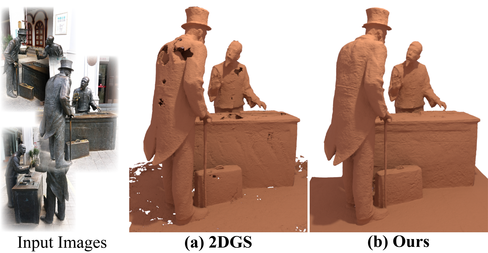

## Geometry Field Splatting with Gaussian Surfels <br><sub>Official PyTorch implementation of the IEEE CVPR 2025 paper</sub>



**Geometry Field Splatting with Gaussian Surfels**<br>
Kaiwen Jiang, Venkataram Sivaram, Cheng Peng, Ravi Ramamoorthi<br>

[**Paper**](https://arxiv.org/abs/2411.17067) | [**Project**]() | [**Video**]() | [**Data\&Results**](https://drive.google.com/drive/folders/1gVJxaJ78o162CWjP-3jMkx46xcRZK_i0?usp=sharing)

Abstract: *Geometric reconstruction of opaque surfaces from images is a longstanding challenge in computer vision, with renewed interest from volumetric view synthesis algorithms using radiance fields. We leverage the geometry field proposed in recent work for stochastic opaque surfaces, which can then be converted to volume densities. We adapt Gaussian kernels or surfels to splat the geometry field rather than the volume, enabling precise reconstruction of opaque solids. Our first contribution is to derive an efficient and almost exact differentiable rendering algorithm for geometry fields parameterized by Gaussian surfels, while removing current approximations involving Taylor series and no self-attenuation. Next, we address the discontinuous loss landscape when surfels cluster near geometry, showing how to guarantee that the rendered color is a continuous function of the colors of the kernels, irrespective of ordering. Finally, we use latent representations with spherical harmonics encoded reflection vectors rather than spherical harmonics encoded colors to better address specular surfaces. We demonstrate significant improvement in the quality of reconstructed 3D surfaces on widely-used datasets.*

## Implementation Outline
In this paper, we propose to first define a stochastic geometry field which is parameterized by 2D Gaussian kernels, and then convert it into the density field for corrected splatting. The conversion and correction are fused into an activation function imposed on the raw weighted 2D Gaussian kernels (which can be found at `auxiliary.h` in the rasterizer). That's how simple it is!

Besides, we propose to spatially blend the out-going radiances to address the discontinuity of loss landscape. This is implemented as periodically (100 iters) calculating the closest `K` kernels for each 2D Gaussian kernel, and then weighted averaging the out-going radiances of these `K` kernels as the out-going radiance for each 2D Gaussian kernel (which can be found at `get_features` and `get_colors` of `scene/gaussian_model.py`).

Parameters are then tuned to suit these changes. We only use the Gaussian distribution for the stochastic geometry field in all our experiments, but we provide the implementations for the laplacian and logistic distributions as well (not tested!).

## Requirements
- We have done all the experiments on the Linux platform with NVIDIA 3080 GPUs and 6000 Ada GPUs.
- Dependencies: see [environment.yml](./environment.yml) for exact library dependencies. You can use the following commands with Miniconda3 to create and activate your Python environment.
```bash
conda env create -f environment.yml
conda activate geometry_splatting
./install.sh
```

## Getting started
### Dataset Preparation
Please refer to [this link](https://github.com/graphdeco-inria/gaussian-splatting#processing-your-own-scenes) about the dataset preparation. Notice that our method only supports the ideal pinhole camera.

### Training
Please use the following command to train a scene:
```bash
python train.py -s <path to COLMAP or NeRF Synthetic dataset>
```

Commandline arguments for regularizations:
```bash
--lambda_normal          <number>    # hyperparameter for normal consistency
--lambda_distortion      <number>    # hyperparameter for depth distortion
--color_mode             <sh|latent> # hyperparameter for choosing the color 
                                     # representation

--geovalue_cull          <number>    # hyperparameter of the lower bound of 
                                     # geometry value of kernel to be culled
--ndc_start_iteration    <number>    # hyperparameter of the iteration to
                                     # incorporate the normal consistency loss
--not_propagate_features (Optional)  # Whether to disable the spatially blending
```

**Tips for adjusting the parameters on your own dataset and hardware:**
- For large-scene cases, we suggest using the spherical harmonics color representation, i.e., `--color_mode sh`. While for object-centric cases, we suggest using the latent color representation, i.e., `--color_mode latent`.
- For more specular cases, we suggest trying lowering down the `geovalue_cull` to `0.5755` to make the culling more conservative if holes are observed.
- For latent representation of color, we find that occasionally, setting the `ndc_start_iteration` to `500` to start the normal consistency loss earlier helps reduce the geometry ambiguity.
- If you are working on GPUs with relatively tight budget of VRAM (such as `~10GB`), you may wish to pass in `--not_propagate_features` to reduce the memory consumption and improve the speed significantly. However, we have tested that on the DTU dataset, the spatially blending should not raise the OOM issue.

### Testing
#### Bounded Mesh Extraction
Please use the following command to extract the mesh for bounded dataset:
```bash
python render.py -m <path to pre-trained model>
```
Commandline arguments for adjusting the TSDF fusion:
```bash
--voxel_size  # voxel size
--depth_trunc # depth truncation
```
If these arguments are not specified, the script will automatically estimate them using the camera information.

If the dataset belongs to the DTU datasets or BMVS datasets, the script will also automatically trigger the mesh quality evaluation.

#### Unbounded Mesh Extraction
Please use the following command to extract the mesh for unbounded dataset:
```bash
python render.py -m <path to pre-trained model> --unbounded
```
Commandline arguments for adjusting the mesh granularity:
```bash
--mesh_res    # resolution for unbounded mesh extraction
```

## Full Evaluation
We provide scripts to evaluate the geometric reconstruction quality of our method. Notice that there are some randomness within each run, and we provide the extracted meshes of DTU and BMVS datasets at [this link](https://drive.google.com/drive/folders/1gVJxaJ78o162CWjP-3jMkx46xcRZK_i0?usp=sharing) for reference.

There are also some discrepancies between the results of this repository and the reported results of first ArXiv version. Please be subject to this version and the final version of the paper. Generally speaking, the geometry reconstruction and view synthesis quality have been improved.

### Dataset Preparation
We provide the processed datasets of DTU and BMVS at [this link](https://drive.google.com/drive/folders/1gVJxaJ78o162CWjP-3jMkx46xcRZK_i0?usp=sharing).

For evaluating the DTU dataset, please download the [ground truth](https://roboimagedata.compute.dtu.dk/?page_id=36) and put it under the folder `./dataset/dtu`. The folder structure is expected as:
```
dataset
|---dtu
    |---dtu_gt
        |---ObsMask
        |---Points
        |---SampleSet
```

### Geometry Reconstruction
For geometry reconstruction on the DTU dataset, please use the following command:
```bash
python scripts/dtu_eval.py --dtu <path to the preprocessed DTU dataset>   \
     --color_mode <sh|latent>
```
We provide the following evaluation results for reference:
<details>
<summary><span style="font-weight: bold;">Table Results</span></summary>

Chamfer distance on DTU dataset (lower is better)

| Color Rep. | 24   | 37   | 40   | 55   | 63   | 65   | 69   | 83   | 97   | 105  | 106  | 110  | 114  | 118  | 122  | Mean |
|------------|------|------|------|------|------|------|------|------|------|------|------|------|------|------|------|------|
| SH         | 0.38 | 0.63 | 0.30 | 0.35 | 0.79 | 0.63 | 0.65 | 1.10 | 1.21 | 0.62 | 0.48 | 1.18 | 0.33 | 0.42 | 0.38 | 0.63 |
| Latent     | 0.40 | 0.59 | 0.39 | 0.38 | 0.72 | 0.59 | 0.65 | 1.08 | 0.93 | 0.59 | 0.50 | 0.67 | 0.34 | 0.47 | 0.40 | 0.58 |
</details>
<br>

For geometry reconstruction on the BMVS dataset, please use the following commands:
```bash
python scripts/mvs_obj_eval.py --dtu <path to the preprocessed BMVS object-centric dataset>   \
     --color_mode <sh|latent>

python scripts/mvs_scene_eval.py --dtu <path to the preprocessed BMVS scene-level dataset>   \
     --color_mode <sh|latent>
```
We provide the following evaluation results for reference:
<details>
<summary><span style="font-weight: bold;">Table Results</span></summary>

Chamfer distance ($\times10^{-2}$) on BMVS dataset -- Object-centric Cases (lower is better)

| Color Rep. | Bear | Clock | Dog | Durian | Jade | Man | Sculpture | Stone | Mean |
|------------|------|------|------|------|------|------|------|------|------|
| SH         | 0.55 | 0.17 | 0.40 | 2.63 | 0.14 | 0.43 | 0.36 | 0.71 | 0.67 |
| Latent     | 0.60 | 0.13 | 0.25 | 2.58 | 0.14 | 0.44 | 0.36 | 0.80 | 0.66 |

Chamfer distance ($\times10^{-1}$) on BMVS dataset -- Scene-level Cases (lower is better)

| Color Rep. | EvaUnit | Temple | Excavator | Museum | Mean |
|------------|------|------|------|------|------|
| SH         | 1.48 | 1.89 | 0.72 | 1.98 | 1.52 |
| Latent     | 1.58 | 2.13 | 0.87 | 2.26 | 1.71 |
</details>
<br>

## FAQs
- **I want to test on the Tanks\&Temples Dataset.** We have conducted experiments on the Tanks\&Temples dataset. However, since the ground-truth camera parameters are not given, the extracted meshes are required to first be aligned with the ground-truth meshes. We find some existing alignment scripts not really robust as the extracted mesh fails to be aligned with the ground-truth mesh (specifically, the `Truck` and `Meeting Room` scenes), which results in mistakenly low F1 scores. To evaluate on the Tanks\&Temples dataset, you may wish to evaluate the results using a robust alignment script.
- **I want to get better geometric quality.** In this paper, we mainly focus on evaluating the proposed geometry field splatting. We are aware of many good practice developed in the community to further improve the geometric quality and intentionally choose not to incorporate them in our initial version, such as not to shadow our main contributions. Please find more discussion about this in Sec. D of our supplementary. Known issues include over-densified regions due to quite opaque 2D Gaussian kernels and geometric ambiguity. However, as an open-source repository, we may plan to incorporate some such good practice and welcome any such contributions!

## Acknowledgements
This project is mainly built upon [2DGS](https://github.com/hbb1/2d-gaussian-splatting), [AbsGS](https://github.com/TY424/AbsGS), and [Object as volumes](https://github.com/cmu-ci-lab/volumetric_opaque_solids). The TSDF fusion parameters are tuned following [PGSR](https://github.com/zju3dv/PGSR). We thank their authors for their great repos!

## Citation
```bibtex
@article{jiang2024geometry,
  title={Geometry Field Splatting with Gaussian Surfels},
  author={Jiang, Kaiwen and Sivaram, Venkataram and Peng, Cheng and Ramamoorthi, Ravi},
  journal={arXiv preprint arXiv:2411.17067},
  year={2024}
}
```